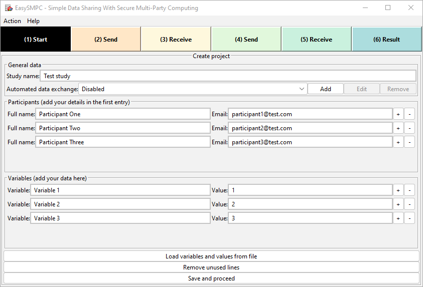

# EasySMPC - No-Code Secure Multi-Party Computation

> EasySMPC is an app for securely summing up distributed confidential data 
> using Secure Multi-Party Computation (SMPC). It is designed to enable 
> simple statistical analysis with maximum usability, easy access and a 
> strict no-coding approach. Your parents should be able to use this and 
> so should your physician!

---

### [Prerequisites](#prerequisites) ⚫ [Installation](#installation) ⚫ [Features](#features) ⚫ [Screenshot](#screenshot) ⚫ [Quick start guide](#quick-start-guide) ⚫ [Command line version](#command-line-version) ⚫ [Contact](#contact) ⚫ [License](#license) ⚫ [Acknowledgements](#acknowledgments)

---

## Prerequisites

EasySMPC requires [Java](https://adoptopenjdk.net/), at least in version 13. The Java
runtime is bundled in our Installer package.

To compile the app from source in addition to the Java JDK the [Maven build
system](https://maven.apache.org/) is required.

## Installation

EasySMPC does not need an installation and can be used as a Java jar package.
However, to increase portability we packaged the nessecary Java runtime with our
application in an installer to build an executable for Linux, Windows and Mac
OSX. This installer does not need any administrator priviledges and should be
run as a user. The installers for Windows and MacOS are not signed.
Thus a respective message while installing must be confirmed.

### Get binary installer

Check out [our releases
page](https://github.com/prasser/easy-smpc/releases) for Windows,
Linux and MacOS executables.

### Build from Source

To build the executable yourself, please clone this repository and build with
maven  (```mvn package```). The assembled executable should be in the target
directory. At present time some tests occasionaly fail. We're looking into that.
Until those tests are passing please compile with ```mvn package -DskipTests```.

To build the installer please build the jar package as described above and then
use the supplied scripts for your target platform. E.g.:
```
cd installer && ./linux.sh
```

## Features

EasySMPC was built to allow non-technical personell in medical research perform
simple analysis without sharing their input data. We tried to achieve a very low
threshold of technical prerequisites by using email as an, in most cases,
already established and configured communication medium.

* Easy to use
* Communication using established channels, e.g. emails
* Excel and CSV import and export
* Automation of the protocol using a shared IMAP-Mailbox
* Automatic Proxy-Detection

### Security

EasySMPC uses Arithmetic Secret Sharing
[\[DZS15\]](https://www.ndss-symposium.org/ndss2015/ndss-2015-programme/aby---framework-efficient-mixed-protocol-secure-two-party-computation/),
the arithmetic extension of the GMW-Protocol
[\[GMW87\]](https://dl.acm.org/doi/10.1145/28395.28420) to achieve the private
computation of the sums. It uses a ring of size , the 12th Mersenne
prime.

### We are working on

  - Differential Privacy
  - Automate email communication with private mailboxes
  - Support for decimal numbers
  - Use EasySMPC with Slack/Mattermost/IRC/...
  - Examples and Getting Started guides
  - Further Documentation

## Screenshot



## Quick start guide

1. As a study initiator, click on _Create new project_ and enter the names of all participants, their e-mail addresses, the variables to sum up and your own confidential data. For performing the computation, you can choose between an automatic or a manual mode.

     a)	In _manual mode_ the users need to exchange all messages by sending and receiving e-mails manually.
     
     b) In _automatic mode_ participants receive and import the initial message manually into EasySMPC (see 2). All further messages are exchanged automatically via their respective mailboxes. If the study initiator chooses automatic mode, all participants also have to choose automated mode. The user name and connection details provided for the automated mode will be saved for future use, the password will not be saved and must be re-entered if the study was closed in between.
2. As a participant, you copy the message you received via email into the clipboard, click on _Participate in project_ in EasySMPC and paste the content. You will now see the study definition and can enter your own confidential data and mail box details if applicable.
3. As an initiator or participant, you now click on proceed. If running in automated mode, EasySMPC will automatically perform all steps until the final result is displayed. If running in manual mode, all users need to send and receive e-mails prepared by EasySMPC to perform the computation.
4. The final perspective shows the result of the secure addition of all variables.

## Command line version
There is also a command line version of EasySMPC. After [building](#build-from-source) use the jar easy-smpc-cli-*{Version}*.jar as a creator and as two participants or more.

### Creator
Execute the program with `java -jar easy-smpc-cli-*{Version}*.jar -create -l STUDY_NAME -b FILES_PATH_VARIABLES -d FILES_PATH_DATA -f PARTICIPANTS -a EMAIL_ADDRESS -p PASSWORD -i IMAP_HOST -x IMAP_PORT -y IMAP_ENCRYPTION -s SMTP_HOST -z SMTP_PORT -q SMTP_ENCRYPTION`. The parameters mean to the following:
1. `-create`: Indicates the creation of a new EasySMPC process
2. `-l STUDY_NAME`: Name/title of the study. Muste be same same for the creator and all participants.
3. `-b FILE_PATH_VARIABLES`: The names of the variables to exchange in Excel or CSV-files with one row or column in the format *firstFile.xlsx,secondFile.csv*
4. `-d FILE_PATH_DATA`: The data to add in Excel or CSV-files with two rows or columns in the format *firstFile.xlsx,secondFile.csv*. The first row/column will be used as the name of the variable, the second will be used as the value with only numbers and a point or comma as decimal separator. Variables for which no value can be found will be set to zero for the creator.
5. `-f FILE_PATH_PARTICIPANTS`: The names and e-mail addresses of the participants in the form *name1,emailAddress1;name2,emailAddress2;name3,emailAddress3...*. The first name and e-mail address will be the creator.
6. `-a EMAIL_ADDRESS`: E-mail address to be used.
7. `-p PASSWORD`: Password of the e-mail address used.
8. `-i IMAP_HOST`: Hostname of the IMAP server.
9. `-x IMAP_PORT`: Port of the IMAP server.
10. `-y IMAP_ENCRYPTION`: IMAP server uses SSL/TLS or Starttls. Use either SSLTLS or STARTTLS.
11. `-s SMTP_HOST`: Hostname of the SMTP server.
12. `-z SMTP_PORT`: Port of the SMTP server.
13. `-q SMTP_ENCRYPTION`: SMTP server uses SSL/TLS or Starttls. Use either SSLTLS or STARTTLS.
 
After executing check the result in the file `result_<study name>_<timestamp>.xlsx` or check the file easy-smpc.log for details of errors.

Please note that in addition to the parameters mentioned above the following optional parameters exists:
1. `-u`: Pass this parameter if an automatically detected proxy server will be used contact the e-mail server. This feature is experimental.
2. `-h`: Pass this parameter if the data in the data and variables files are oriented horizontally
3. `-e`: Pass this parameter if the data in the data and variables files have headers, which need to be skipped
4. `-j N_COLUMNS_TO_SKIP`: Pass this parameter to skip the first n columns

### Participant
Execute the program with `java -jar easy-smpc-cli-*{Version}*.jar -participate -l STUDY_NAME -d FILE_PATH_DATA -o PARTICIPANT_NAME -a EMAIL_ADDRESS -p PASSWORD -i IMAP_HOST -x IMAP_PORT -y IMAP_ENCRYPTION -s SMTP_HOST -z SMTP_PORT -q SMTP_ENCRYPTION`. Most parameters are explained in [Creator](#Creator), other parameters are described below:
1. `-participate`: Indicates the participation in a new EasySMPC process.
2. `-l STUDY_NAME`: Name/title of the study. Muste be same same as for the creator. Must be the same as for the creator.
3. `-o PARTICIPANT_NAME`: Name of the participant as defined in the participants files by the creator.
4. `-d FILE_PATH_DATA`: The data of the participant to add. The format is the same as for the [Creator](#Creator).

After executing check the result in the file `result_<study name>_<timestamp>.xlsx` or check the file easy-smpc.log for details of errors.


### Sample 
Data for a sample can be found in the folder `sample-cli`. A sample process with this data might can be started with these three commands: 
 1. `java -jar easy-smpc-cli-*{Version}*.jar -create -b "-create -l "sample Study" -b ./sample/variables.xlsx -d "./sample/PKU comorbidities.xlsx" -f "Creator,easysmpc.dev0@gmail.com;Participant1,easysmpc.dev1@gmail.com;Participant2,easysmpc.dev2@gmail.com" -a easysmpc.dev0@gmail.com -p thePassword -i imap.gmail.com -x 993 -y SSLTLS -s smtp.gmail.com -z 465 -q SSLTLS`
2. `java -jar easy-smpc-cli-*{Version}*.jar -participate -l "sample Study" -d "./sample/PKU comorbidities.xlsx" -o Participant1 -a easysmpc.dev1@gmail.com -p thePassword-i imap.ionos.de -x 993 -y SSLTLS -s smtp.ionos.de -z 465 -q SSLTLS5`
3. `java -jar easy-smpc-cli-*{Version}*.jar -participate -l "sample Study" -d "./sample/PKU comorbidities.xlsx" -o Participant2 -a easysmpc.dev2@gmail.com -p &r6=Jbh9 -i imap.ionos.de -x 993 -y SSLTLS -s smtp.ionos.de -z 465 -q SSLTLS`

The single commands are expected to start on different folders or better different computers. If they start on one computer, errors of writing log and result files can happen. Also in this minimal test the same data file `PKU comorbidities.xlsx` is used for each party. However, in a real-world usage each participant would use different data in the file

### Troubleshooting
#### Neither an error nor a result
Should the program wit for an unreasonable time without throwing an error, first check whether EasySMPC-related e-mails are in a spam folder (the title of the e-mails start with [EasySMPC]). If so just copy them into the regular inbox.
If nothing can be found in the spam folder, it is likely that the different programs are using different EasySMPC studies with the same name. To solve the issues either (1) delete all e-mails in all mailboxes starting with [EasySMPC] in the title or (2) restart the process with a new name for all participants as well as the creator.

## Contact

If you have questions or problems, we would like to invite you to
[open an issue at
Github](https://github.com/prasser/email-smpc-histogram/issues). This allows
other users to collaborate and (hopefully) answer your question in a timely
manner. If your request contains confidential information or is not suited for a
public issue, send us an email.

EasySMPC's core development team consists of:

* [Tobias Kussel](https://github.com/TKussel) - Cryptography - [tobias.kussel@cysec.de](tobias.kussel@cysec.de)
* [Armin Müller](https://github.com/burgadon) - Graphical user interface - [armin.mueller@charite.de](armin.mueller@charite.de)
* [Fabian Prasser](https://github.com/prasser) - Software design and architecture -[fabian.prasser@charite.de](fabian.prasser@charite.de)
* [Felix Nikolaus Wirth](https://github.com/fnwirth) - Graphical user interface - [felix-nikolaus.wirth@charite.de](felix-nikolaus.wirth@charite.de)

## License

This software is licensed under the Apache License 2.0. The full text is
accessible in the [LICENSE file](LICENSE).

EasySMPC uses the following dependencies:

 - [FlatLaf](https://github.com/JFormDesigner/FlatLaf) - Apache License 2.0
 - [Apache HTTPClient](https://hc.apache.org/httpcomponents-client-5.0.x/) - Apache License 2.0
 - [HPPC: High Performance Primitive Collections](https://github.com/carrotsearch/hppc) - Apache License 2.0
 - [Apache POI-OOXML](http://poi.apache.org/components/oxml4j/) - Apache License 2.0
 - [Apache Commons CSV](http://commons.apache.org/proper/commons-csv/) - Apache License 2.0
 - [jUnit](https://github.com/junit-team/junit5) (Unit tests only) - Eclipse Public License v2.0
 - [Proxy Vole](https://github.com/akuhtz/proxy-vole) - Apache License 2.0
 - [Apache Logging](https://logging.apache.org/log4j) - Apache License 2.0
 - [LMAX Disruptor](https://github.com/LMAX-Exchange/disruptor) - Apache License 2.0


## Acknowledgments

This project is partly financed by the "Collaboration on Rare Diseases" of the
Medical Informatics Initiative, funded by the German Federal Ministry of
Education and Research (BMBF).
